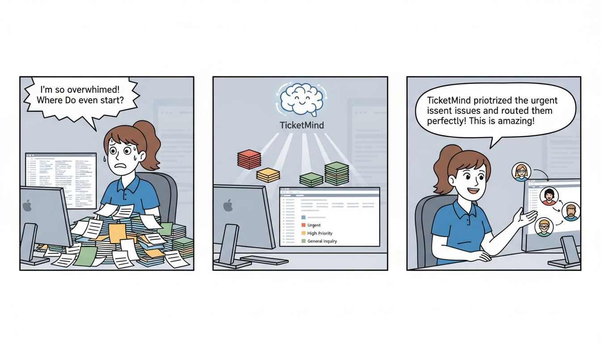

# 🧠 TicketMind: The Oracle of Support Incidents

[](https://ui5.sap.com/)
[](https://opensource.org/licenses/MIT)

**TicketMind** is an intelligent SAP Fiori application designed to transform helpdesk management. By leveraging sentiment analysis and predictive classification, it helps support teams prioritize, categorize, and assign incoming tickets automatically, ensuring that critical issues are addressed by the right people at the right time.

---

## 🚀 Key Features

*   **Sentiment Analysis:** Automatically detects the emotional tone of a ticket (e.g., Frustrated, Satisfied, Neutral).
*   **Predictive Classification:** Intelligently suggests categories and priorities based on ticket descriptions.
*   **Automated Routing:** Recommends the best-fit technical team for assignment.
*   **Bulk Processing:** Integrated `FileUploader` fragment for importing and analyzing large datasets of tickets.
*   **Modern UI:** Built on the `sap_horizon` theme for a clean, accessible, and responsive user experience.

---

## 🛠 Tech Stack

-   **Frontend:** SAPUI5 (Version 1.120.23)
-   **Service:** OData V2 (ABAP On-Premise)
-   **Tooling:** UI5 CLI, SAP Fiori Tools
-   **Testing:** QUnit and OPA5
-   **Language:** JavaScript (ES6+)

---

## 📂 Project Structure

```text
fiori-ticketmind/
├── webapp/
│   ├── controller/          # Logic for Views (App, Main, FileUploader)
│   ├── view/                # XML Views (MainView, App)
│   ├── view/fragments/      # Reusable UI components (FileUploaderDialog)
│   ├── model/               # Data models and custom Formatters
│   ├── i18n/                # Internationalization (EN, ES, etc.)
│   ├── util/                # Utility functions
│   └── test/                # Unit and Integration (OPA5) tests
├── ui5.yaml                 # UI5 tooling configuration
└── package.json             # Scripts and dependencies
```

---

## 🚦 Getting Started

### Prerequisites
-   [Node.js](https://nodejs.org/) (latest LTS recommended)
-   [UI5 CLI](https://sap.github.io/ui5-tooling/pages/CLI/) installed globally (`npm install --global @ui5/cli`)

### Installation
1. Clone the repository:
   ```bash
   git clone https://github.com/your-repo/fiori-ticketmind.git
   cd fiori-ticketmind
   ```
2. Install dependencies:
   ```bash
   npm install
   ```

### Running the App
*   **With Mock Data (Recommended for Testing):**
    This uses the local `metadata.xml` and mock data files.
    ```bash
    npm run start-mock
    ```
*   **With Live Backend:**
    Requires access to the `ZSENTIMENTAPP_ODATA_PROJECT_SRV` service.
    ```bash
    npm start
    ```

---

## 💻 Code Examples

### Custom Formatter (Sentiment Highlighting)
The application uses a custom formatter (`webapp/model/formatter.js`) to provide visual cues based on ticket sentiment.

```javascript
// webapp/model/formatter.js
export default {
    sentimentState: function (sSentiment) {
        switch (sSentiment) {
            case "Positive":
                return "Success";
            case "Negative":
                return "Error";
            case "Neutral":
                return "Warning";
            default:
                return "None";
        }
    }
};
```

### Fragment Usage (File Upload)
The app utilizes fragments for a modular UI. The `FileUploaderDialog.fragment.xml` allows users to upload helpdesk datasets in bulk.

```xml
<!-- webapp/view/fragments/FileUploaderDialog.fragment.xml -->
<core:FragmentDefinition xmlns="sap.m" xmlns:u="sap.ui.unified" xmlns:core="sap.ui.core">
    <Dialog title="{i18n>uploadTitle}">
        <u:FileUploader 
            id="ticketUploader"
            name="myFileUpload"
            uploadUrl="upload/"
            change="onFileChange"
            fileType="csv,xlsx"/>
        <beginButton>
            <Button text="{i18n>process}" press="onProcessUpload" type="Emphasized"/>
        </beginButton>
    </Dialog>
</core:FragmentDefinition>
```

---

## 🧪 Testing

The repository includes a comprehensive test suite located in `webapp/test`.

*   **Unit Tests:** Test individual controller logic and formatters.
    ```bash
    npm run unit-test
    ```
*   **Integration Tests (OPA5):** Test end-to-end user journeys (e.g., navigation).
    ```bash
    npm run int-test
    ```

---

## 📦 Deployment

To build the application for deployment to an ABAP Repository or SAP BTP:

```bash
npm run build
```
The production-ready artifacts will be generated in the `/dist` folder.

---

## 📄 Application Metadata

| Attribute | Value |
| :--- | :--- |
| **App Generator** | SAP Fiori Application Generator (1.17.5) |
| **UI5 Version** | 1.120.23 |
| **Theme** | sap_horizon |
| **Service Name** | ZSENTIMENTAPP_ODATA_PROJECT_SRV |

---
*Developed with ❤️ using SAP Fiori.*